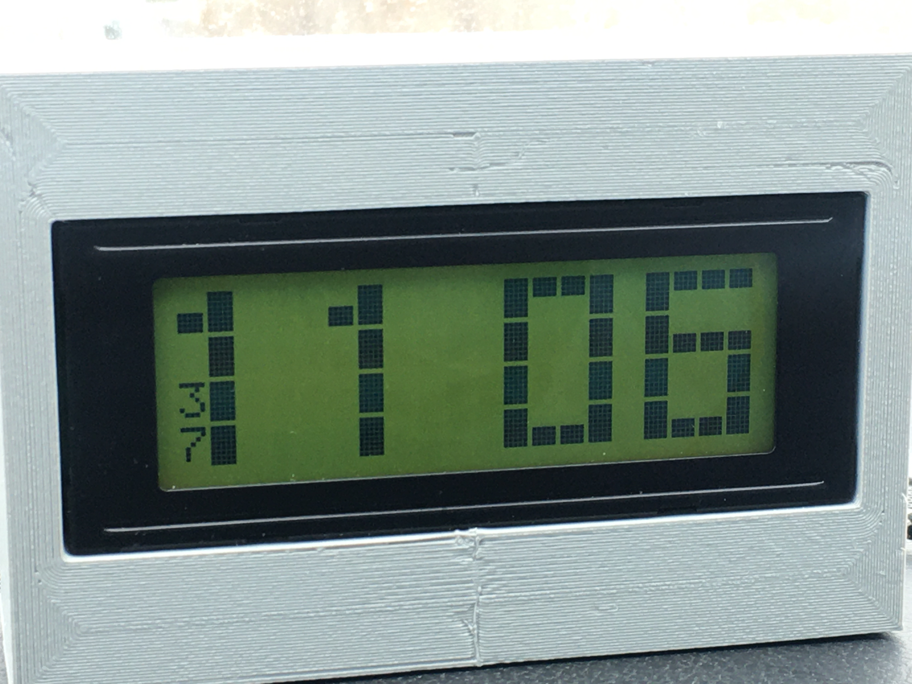
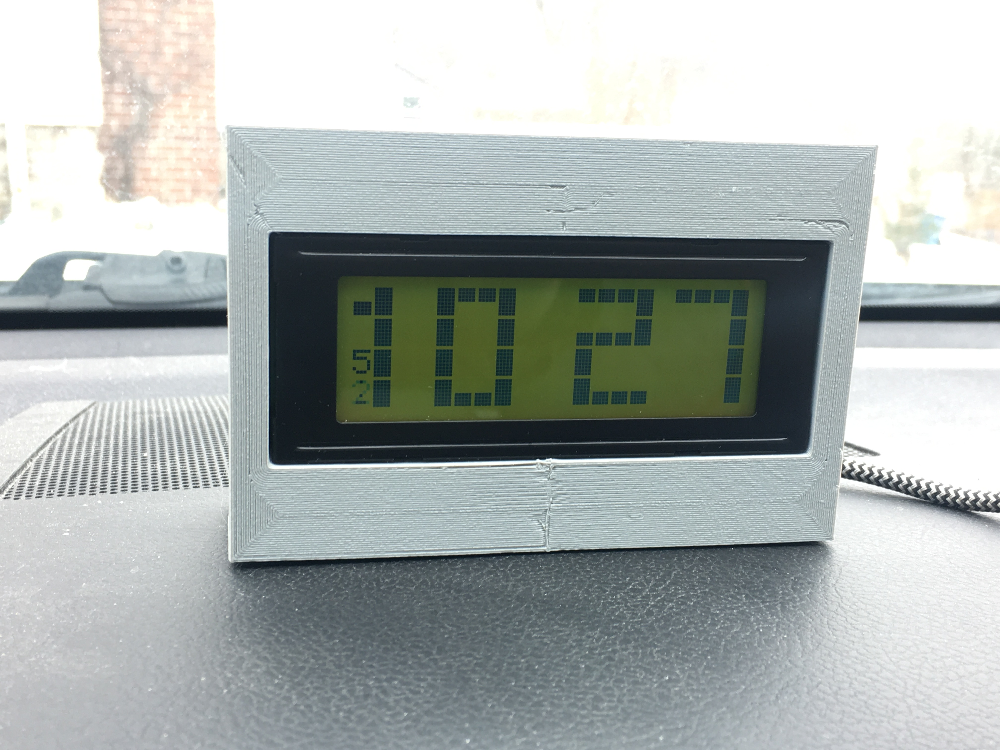

# CarClock-ESP8266

## Overview
( Please see the <b>Overview</b> section in the README.md file in the parent directory. )

## PlatformIO

This clock project was developed in PlatformIO.

## ASCII "Screen" Display

Starting with version 1.2, there is an ASCII "screen" which mimics what is on the real LCD2004.  This "screen" is output to the serial port every time something major changes on the screen (e.g., informational screens are displayed; the time changes to the next minute; etc).

Here are some examples of what you would see :

An "all text" screen (no special characters are displayed) :

    [02/22/2026 9:27:43 PM]  +--------------------+
    [02/22/2026 9:27:43 PM]  |Searching for       |
    [02/22/2026 9:27:43 PM]  |WiFi networks...    |
    [02/22/2026 9:27:43 PM]  |                    |
    [02/22/2026 9:27:43 PM]  |Please wait.        |
    [02/22/2026 9:27:43 PM]  +--------------------+

Note that if you don't have an RTC connected to the Wemos D1 Mini, the above time will likely be way off as the only way the clock will be able to get the time is via NTP, and since it's not connected to a WiFi network yet, the time will be off.  However, once the time is successfully retrieved, the clock will display the correct time.

Once the clock gets the time, the screen will look something like the following.  Note that the hours and minutes sort-of mimic the programmable characters that we're using on the real LCD2004.  The seconds are displayed in the bottom left corner -- they are presented vertically so they won't run into the "1" that is displayed for 10 o'clock and beyond.

    [02/22/2026 9:27:58 PM]  +--------------------+
    [02/22/2026 9:27:58 PM]  |    *--*   ---* ---*|
    [02/22/2026 9:27:58 PM]  |    *__*   ___*    *|
    [02/22/2026 9:27:58 PM]  |5      *   *       *|
    [02/22/2026 9:27:58 PM]  |8      *   *___    *|
    [02/22/2026 9:27:58 PM]  +--------------------+

At the top of every minute, the screen is shown again :

    [02/22/2026 9:56:00 PM]  +--------------------+
    [02/22/2026 9:56:00 PM]  |    *--*   *--- *---|
    [02/22/2026 9:56:00 PM]  |    *__*   *___ *___|
    [02/22/2026 9:56:00 PM]  |       *      * *  *|
    [02/22/2026 9:56:00 PM]  |0      *   ___* *__*|
    [02/22/2026 9:56:00 PM]  +--------------------+

    [02/22/2026 9:57:00 PM]  +--------------------+
    [02/22/2026 9:57:00 PM]  |    *--*   *--- ---*|
    [02/22/2026 9:57:00 PM]  |    *__*   *___    *|
    [02/22/2026 9:57:00 PM]  |       *      *    *|
    [02/22/2026 9:57:00 PM]  |0      *   ___*    *|
    [02/22/2026 9:57:00 PM]  +--------------------+

Here's an example of a time between 10:00 and 11:59 :

    [02/22/2026 10:37:32 PM]  +--------------------+
    [02/22/2026 10:37:32 PM]  |_*  *--*   ---* ---*|
    [02/22/2026 10:37:32 PM]  | *  *  *    __*    *|
    [02/22/2026 10:37:32 PM]  |3*  *  *      *    *|
    [02/22/2026 10:37:32 PM]  |2*  *__*   ___*    *|
    [02/22/2026 10:37:32 PM]  +--------------------+

Yes, it's pretty rough, but it's only for debugging.  I did this because I had already installed my full-fledged car-clock in my car, and I didn't want to rip it out and bring it inside just for some software changes.  I ended up using a different Wemos D1 Mini (that did not have an LCD2004 nor RTC connected to it) while I was developing firmware versions 1.1 and 1.2.  Since I was making changes to what was being displayed on the LCD, I decided to make this ASCII "screen" so I could get an idea of what the real LCD2004 screen would look like.  In the end, it actually turned out better than I was expecting (hey, it gets the job done).

There are actually two variations of this "screen" -- normal pure-ASCII and VT100 emulation.

* <ins>Normal Mode</ins> -- The examples shown above are in normal mode.  Since some of the digits on the actual LCD2004 use programmable characters, it's not really possible to mimic those programmable characters using just normal ASCII characters.  That's why things don't alight perfectly in the examples above.

* <ins>VT100 Emulation Mode</ins> -- By setting the <b>m_VT100_Emulation</b> attribute (located in <b>src/MyDisplay_LCD2004.cpp</b>) to 'true' , the special characters will actually be VT100 escape sequences.  This comes in handy if you use something like TeraTerm to talk to the serial port of the ESP8266 (TeraTerm emulates a VT100 terminal by default).  However, the code is developed using PlatformIO, and as far as I can tell, the built-in PlatformIO terminal program does not emulate a VT100, which is a bummer.

The default mode is "Normal Mode".

## What It Really Looks Like

Here are some pics and videos of the CarClock-ESP8266 in action...

<ins>Pictures</ins>

 <ins>Videos</ins>

  <video src="CarClock-ESP8266/images/CarClock-003.mp4" width="600" muted autoplay loop playsinline controls>
  </video>

### Notes

* When the time is initially displayed, it's a rough guess of the time, and when it's updated, it will jump to the proper time.

* When the hours and minutes are displayed, I intentionally have the digits displayed "slowly" as I like that effect.  You can speed it up by changing the appropriate delay() commands in MyDisplay_LCD2004.cpp.

* The seconds are displayed in a column in the bottom left corner of the display.  I display them in a column format so they don't run into the "1" of the hours tens-unit.  Also, if the seconds are below 10 (i.e, a single digit), the leading 0 is suppressed.

* The colons will blink as astrisks (*) if the clock is connected to a WiFi network.  If not connected to a network, they will blink as exclamation points (!).

## OTA (Over The Air) Programming

With regards to firmware updates, I added OTA (Over The Air) programming support.  I find this handy since I've already mounted the clock on the dash of my car, and instead of ripping the clock out and bringing it inside just to program it, I simply plug the clock into a USB power bank then I can stay inside the house, make changes to the code and program the clock OTA without having to have my car running all the time.  I use a large power bank that will run for hours, so power isn't an issue.

When I'm done making changes locally (on the non-LCD Wemos D1 Mini that's sitting by my laptop), I just use OTA to push the code to the clock in my car, and by the time I walk out to my car, the code has been loaded, the Wemos D1 Mini has rebooted, and it's and running the new code.

## I2C Devices

The following I2C devices are connected to the Wemos D1 Mini :

* 0x27 : LCD Backpack.
* 0x57 : AT24Cxxx EEPROM series (on RTC board).  (Currently not using this.)
* 0x68 : DS3231 RTC.

## The 3D Printed Case

Yeah, the case is a little rough, but (1) I was under a time crunch to get this done and I wanted to get _something_ in the car, and (2) I really don't care (unlike a certain fellow 3D printing enthusiast that I know -- yeah, you know who you are... ;-)  I might end up reprinting it using some sort of translucent filament so I can see the on-board Wemos D1 Mini LED, but then again, that might be distracting at night.  Time will tell...

## The Future

I'm planning on adding the following things to the clock :

* Weather information.  Have the clock fetch the current temperature information (and possibly the forecast) when the clock connects to a WiFi network.  Probably display this weather information once when the clock powers up and initially connects to a network.

* Open WiFi networks.  Scan open WiFi networks if unsuccessfuly in connecting to one of the networks in the Secrets.cpp file.  This way, if I make a stop somewhere (gas station, rest stop, etc), when I start the car back up, it would try to get the latest weather information, time, etc...

* Push button.  This would allow me to cycle through screens, such as the time -> weather information -> current WiFi information, etc...

* A rotary encoder with a push button.  Might do this instead of the above mentioned push button, but it depends on how many inputs I have available on the Wemos D1 Mini.

* A piezo electric element or a speaker or such.  Could make some noises as it's doing it's work.  For example, it could beep when it successfully connects to a network and do a different beep when it disconnects from a network.

